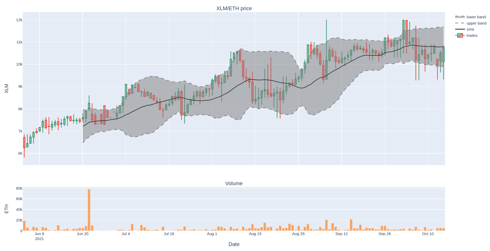

# Stellar decentralized exchange plotting utility

This is a small utility to generate graphs for the [stellar decentralized
exchange](https://developers.stellar.org/docs/glossary/decentralized-exchange/).
It can display candlestick charts with simple moving average and bollinger bands.

## Installation

See required packages in Pipfile.

To set up virtual environment use:

```
git clone https://github.com/vahlkar/stellar-plot.git
cd stellar-plot
pipenv install
```

## Usage

```
pipenv shell
./stellar.py base counter [resolution] [start] [end]
```

- base: base asset code.
- counter: counter asset code.
- resolution: time interval for trade aggregation. Possible values are: `1m`,
  `5m`, `15m`, `1h`, `1d`, `1w`. Optional, defaults to `1d`.
- start: start date (format `%Y-%m-%d`). Optional, defaults to 30 days prior
  end date.
- end: end date (format `%Y-%m-%d`). Optional, defaults to today.

Available asset codes are currently hardcoded in the script.
To add more assets, add entries in the assets dictionary.
More assets can be found on [stellar.expert](https://stellar.expert/).

## Example

```
./stellar.py eth xlm 1d 2021-06-01
```



## Improvements

Ideas for improvement:

- load asset codes and default values from separate configuration file.
